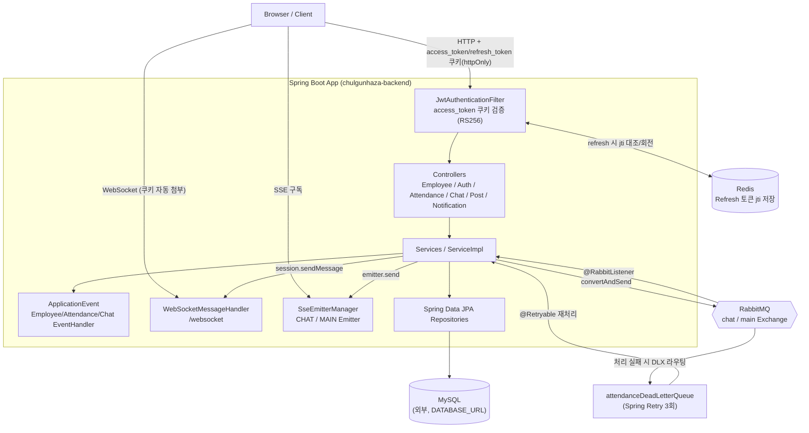

## 출근하자! 
출퇴근 기록과 실시간 소통 기능을 강화해 효율적이고 원활한 업무 환경을 제공합니다. 직원들이 편리하게 소통하고 근무를 관리할 수 있는 간단한 그룹웨어 시스템입니다. 

## 실행 가이드

이 저장소(백엔드)와 [chulgunhaza-frontend](https://github.com/chulgunhaza/chulgunhaza-frontend)를 각각 클론해서 같이 띄워야 화면까지 볼 수 있습니다.

### 0. 필요한 것
- Java 17, Node.js 20+
- Docker (RabbitMQ/Redis 컨테이너용 — `spring-boot-docker-compose` 의존성이 있어서 직접 `docker compose up`을 안 해도, 아래 1번을 실행하면 자동으로 떠 있는 상태가 됩니다)
- 접속 가능한 MySQL 8.x (로컬에 별도로 띄우거나 이미 있는 인스턴스를 사용 — `compose.yaml`에는 포함되어 있지 않습니다)

### 1. 백엔드 (이 저장소)

**#99로 Gradle 멀티모듈로 바뀌었습니다** — `user-server`(사원/연차/게시판/대시보드,
:8081)와 `attendance-server`(근태, #100으로 실제 서비스가 됨, :8082)를 같이
띄워야 근태 기능까지 정상 동작합니다. `chatting-server`는 아직 최소
스켈레톤입니다(자세한 구조는 [docs/multi-module-structure.md](docs/multi-module-structure.md) 참고).

```bash
git clone https://github.com/chulgunhaza/chulgunhaza-backend.git
cd chulgunhaza-backend
cp .env.example .env   # 값 채우기(각 변수 설명은 .env.example 주석 참고)

# MySQL에 스키마부터 만들어야 합니다 (user/attendance/chatting 3개로 분리됨).
# root 계정 필요 — MYSQL_ROOT_PASSWORD는 MySQL 컨테이너를 처음 띄울 때 지정한 값.
docker exec -i chulgunhaza-mysql mysql -uroot -p"$MYSQL_ROOT_PASSWORD" < docs/sql/create-schemas.sql

# .env는 파일로 존재하는 것만으로는 안 되고, 셸에 export까지 돼 있어야
# ${DATABASE_URL} 같은 플레이스홀더가 실제 값으로 치환됩니다 — 안 하면
# "Unable to determine Dialect without JDBC metadata" 에러가 납니다.
set -a && source .env && set +a
./gradlew :user-server:bootRun --args='--server.port=8081'

# 근태(출퇴근) 기능까지 쓰려면 별도 터미널에서 attendance-server도 띄웁니다.
set -a && source .env && set +a
./gradlew :attendance-server:bootRun
```
`user-server`가 뜨면 `spring-boot-docker-compose`가 redis/rabbitmq 컨테이너를 자동으로 띄우고, `DataInitializer`가 로그인 테스트 계정과 채팅 더미 데이터를 자동으로 만듭니다(아래 3번 참고). `attendance-server`는 이 컨테이너를 그대로 재사용하므로 순서상 `user-server`를 먼저 띄우는 걸 권장합니다.

### 2. 프론트엔드
```bash
git clone https://github.com/chulgunhaza/chulgunhaza-frontend.git
cd chulgunhaza-frontend
npm install
npm run dev   # http://localhost:3000
```
프론트는 백엔드가 `http://localhost:8081`에 떠 있다고 가정하고 요청을 보냅니다 — 포트를 바꿨다면 프론트 쪽 `src/api/client.ts`의 `baseURL`도 맞춰야 합니다.

### 3. 로그인
서버를 처음 띄우면 `DataInitializer`가 아래 계정과 채팅 더미 데이터(동료 10명과의 1:1 방 10개, 방마다 메시지 250개)를 자동으로 만들어둡니다 — 회원가입 API가 따로 없어서, 이 계정 없이는 갓 받은 DB로 로그인할 방법이 없습니다.

| 이메일 | 비밀번호 | 비고 |
|---|---|---|
| `test@chulgunhaza.com` | `test1234!` | 기본 테스트 계정 |
| `seed-colleague-01@chulgunhaza.com` | `test1234!` | 동료 10명 중 1명(박서준) — 브라우저 2개로 각각 로그인하면 1:1 채팅을 실제로 주고받아볼 수 있습니다 |
| `manager@chulgunhaza.com` | `test1234!` | 근태 관리자(김관리, `UserRole.MANAGER`) — 관리자 페이지(`/admin/employees`, `/admin/attendance`) 접근용 |

운영 배포 시에는 `app.seed-demo-account=false`로 이 초기화 로직을 꺼둡니다.

### 접속 정보
| 서비스 | 주소 |
|---|---|
| 프론트엔드 | http://localhost:3000 |
| 백엔드 API | http://localhost:8081 |
| Swagger UI | http://localhost:8081/swagger-ui/index.html |
| RabbitMQ 관리 UI | http://localhost:15672 (계정은 `.env`의 `RMQ_USER`/`RMQ_PASS`) |

## 기간
2025.01 ~ 진행 중


## 프로젝트 목표
- 직원 관리
- 실시간 소통 및 알림 시스템
- 연차 및 근무 시간 관리
- 근태 현황 시각화
- 관리자와 근태 담당자의 업무 효율화
- 동시성 제어
- 데이터베이스 샤딩
- 부하 테스트


## 주요 기능 (실제 구현 기준)
- **실시간 채팅** - WebSocket(메시지 본문 전달) + SSE(미접속자 알림) 조합, RabbitMQ로 저장 비동기 처리
  - 1:1 채팅 + 단체(그룹) 채팅, 채팅방 나가기
  - 읽음/안읽음을 **참여자별로 독립 추적**(`lastReadMessageId`) — 그룹방에서 한 명이 읽어도 다른 사람 안읽음 수는 그대로
- **근태(출근) 알림** - 출근 등록/연차 사용 처리 결과를 SSE(MAIN 채널)로 실시간 통지
- **연차 사용 동시성 제어** - 비관적 락(`@Lock(PESSIMISTIC_WRITE)`)으로 동시 요청 시 잔여 연차 초과 사용 방지, TDD/동시성 테스트로 검증
- **페이징 처리**
- **권한 관리** - Admin, 근태 담당자, 사원 분리
- **파일 업로드** - MultiPartFile 사용(게시글 첨부, 사원 프로필 이미지). S3 마이그레이션은 아직 미착수(로컬 디스크 저장)
- **트래픽 처리** - RabbitMQ를 통한 출근 등록/채팅 저장 비동기 처리, DLQ + 재시도(`@Retryable`)
- **로그인** - JWT(RS256, httpOnly 쿠키) 기반 access/refresh 토큰 인증 — [#98](https://github.com/chulgunhaza/chulgunhaza-backend/issues/98)에서 세션(Redis) 방식을 대체. 자세한 설계는 [docs/jwt-authentication.md](docs/jwt-authentication.md) 참고
- **소프트 딜리트** - `delFlag` 필드를 통한 소프트 딜리트
- **CORS 화이트리스트** - 설정 기반 origin 화이트리스트(`cors.allowed-origins`)
- **API 문서화** - Swagger/OpenAPI(springdoc), JWT 쿠키(`access_token`) 인증에 맞춰 커스텀 스킴 등록
- **CI** - GitHub Actions로 PR/push 시 테스트 자동 실행

### 아직 구현되지 않은 것 (README 목표 대비)
- Spring Batch 기반 출근 정산
- 데이터베이스 샤딩
- 부하 테스트(현재는 Hibernate Statistics 기반 쿼리 카운트 회귀 테스트로 N+1 여부만 가볍게 관리 — 아래 "테스트" 참고)
- AOP 기반 로그 추적 + 로그 파일 스케줄러
- 파일 업로드 S3 마이그레이션
- HTTPS 적용
- 레플리카(Redis/DB 다운 시 자동 복구) — access 토큰 검증은 JWT 서명만으로 되므로 Redis 없이도 계속 되지만(#98), refresh 토큰 재발급/로그아웃 무효화는 여전히 Redis에 의존한다. 실제 장애 복구 구성은 아직 없음

## 테스트
단위 테스트 + 실제 DB가 붙는 통합 테스트를 합쳐 12개 테스트 클래스가 있습니다(`AnnualLeaveServiceImplConcurrencyTest`, `AppCorsConfigurationSourceTest`, `AttendanceAlarmServiceImplTest`, `ChatMessageListenerTest`, `ChatMessageServiceImplTest`, `ChatRoomServiceImplTest`, `ChatRoomServiceImplQueryCountTest` 등). 특히:
- **동시성**: `CountDownLatch`로 여러 스레드를 정확히 같은 순간에 출발시켜 연차 초과 사용이 절대 발생하지 않는지 검증
- **쿼리 카운트 회귀 테스트**: Hibernate Statistics(`getPrepareStatementCount`)로 채팅방 목록 조회가 N+1 없이 상수 쿼리 수로 끝나는지 실측 검증 — 별도 부하테스트 도구 없이 프로젝트 규모에 맞게 가볍게 성능을 관리
- 나머지 서비스 계층(Attendance/Post 등) TDD 테스트 확충은 [#63](https://github.com/chulgunhaza/chulgunhaza-backend/issues/63)으로 트래킹 중

## 기술


## 아키텍처



### 계층 구조
- **Controller** → **Service(Impl)** → **Repository(JPA)** → **MySQL** 로 이어지는 전형적인 계층형 구조이며, 도메인은 `member`, `attendance`, `annual`, `leaveWork`, `board`, `chat` 로 분리되어 있습니다.
- 인증/인가는 `SecurityConfig` 에서 JWT(RS256) 기반(`SessionCreationPolicy.NEVER`, HttpSession 자체를 아예 안 씀)으로 구성됩니다. `JwtAuthenticationFilter`가 매 요청마다 `access_token` 쿠키의 서명·만료만 검증하므로 WAS(애플리케이션 서버)를 여러 대로 늘려도 별도 세션 공유가 필요 없습니다. Redis는 이제 refresh 토큰의 jti만 저장하는 데 씁니다(`RefreshTokenStore`) — 자세한 설계와 전환 배경은 [docs/jwt-authentication.md](docs/jwt-authentication.md) 참고.
- 도메인 간 부수 효과(알림 발송 등)는 RabbitMQ를 직접 호출하는 대신 **Spring `ApplicationEvent`** (`event/attendance`, `event/chat`, `event/employee`)로 한 번 더 분리되어 있어, 이벤트 발행부와 처리부가 느슨하게 결합되어 있습니다.
- `Chat`/`Attendance`/`AnnualRecord` 도메인은 `Employee`를 `@ManyToOne` 객체 참조가 아니라 `Long employeeId` 값으로만 참조합니다 — 서로 다른 애그리게이트가 객체 그래프로 직접 결합돼 있으면 한쪽 데이터 정합성 문제가 다른 도메인 쿼리까지 깨뜨릴 수 있다는 걸 실제 인시던트로 겪은 뒤([#72](https://github.com/chulgunhaza/chulgunhaza-backend/pull/72)) 정리했고, 장기적으로는 이 도메인들을 별도 서비스로 분리하는 것까지 염두에 두고 있습니다([#74](https://github.com/chulgunhaza/chulgunhaza-backend/issues/74)). `Post`는 아직 이 규칙을 못 지키고 있는 예외인데, 애그리거트 판단 기준과 서비스별 매핑 전체는 [docs/aggregate-boundaries.md](docs/aggregate-boundaries.md)에 정리했습니다.

### 메시징(RabbitMQ) 토폴로지
- `chulgunhazabackend_main` Exchange(Direct, user-server와 attendance-server가 각자 선언하지만 같은 브로커의 같은 exchange를 가리킴) → `attendance_queue`(출근 등록, attendance-server가 발행+소비), `leave_work_queue`(연차), `main_notification_queue`(근태/연차 알림 — **#100부터 attendance-server가 발행하고 user-server의 `MainNotificationListener`가 소비**하는 교차 서비스 채널)
- `chulgunhazabackend_chat` Exchange(Direct) → `chat_queue`(채팅 저장), `chat_notification_queue`(채팅 알림)
- `attendance_queue` 는 `x-dead-letter-exchange` 로 `deadLetterExchange` 를 지정해두어, 컨슈머가 `basicNack` 하면 메시지가 `attendanceDeadLetterQueue` 로 이동하고, `AttendanceDeadLetterListener`(attendance-server) 가 `@Retryable`(최대 3회, 1초 간격)로 재처리를 시도한 뒤 실패하면 `@Recover` 로 넘어갑니다.
- 채팅은 WebSocket으로 받은 메시지를 바로 DB에 쓰지 않고 RabbitMQ에 적재한 뒤 `ChatMessageListener` 가 비동기로 저장하도록 해서, 순간적으로 채팅이 몰려도 DB 부하를 큐가 완충합니다.
- attendance-server가 물리 분리되면서 근태 등록 완료 SSE 알림도 프로세스 경계를 넘어야 했습니다 — RabbitMQ로 이 문제를 푼 상세 설계는 [docs/attendance-server-migration.md](docs/attendance-server-migration.md) 참고.

### 실시간 통신 (WebSocket + SSE 조합)
- **WebSocket**(`/websocket`, `WebSocketMessageHandler`): 채팅방 `subscribe`/`unsubscribe` 세션을 `ConcurrentHashMap<userId, ConcurrentHashMap<chatRoomId, WebSocketSession>>` 형태로 들고 있다가 새 메시지가 오면 바로 push 합니다. STOMP 없이 순수 `WebSocketHandler` + 커스텀 프로토콜로 라우팅하고, `SecurityContextInterceptor` 로 핸드셰이크 시점에 인증 정보를 함께 실어 보냅니다.
- **SSE**(`SseEmitterManager`, `EmitterType.CHAT`/`EmitterType.MAIN`): 두 채널 모두 구현돼 있습니다.
  - `/v1/notifications/subscribe/chat`: 그 채팅방에 지금 WebSocket으로 접속해 있지 않은 사용자에게만 "새 메시지 알림"을 보내는 폴백 채널(`ChatAlarmService`). WebSocket 세션이 있으면 SSE는 안 타고 WS로 바로 전달됩니다.
  - `/v1/notifications/subscribe/main`: 출근 등록/연차 사용 등 근태 관련 이벤트가 **본인에게만** 오는 개인 알림 채널(`AttendanceAlarmService`). 여러 도메인이 공유하는 채널이라 도메인 전용 필드 없이 공통 알림 형태(수신자/메시지/시각)로 통일돼 있습니다. 팀원 전체의 출퇴근 현황을 실시간으로 흘려보내는 기능은 아닙니다(의도적 — 개인정보 노출 방지).
  - 두 채널 모두 로그인한 사용자당 emitter 슬롯이 **하나**뿐이라, 같은 채널을 여러 곳에서 동시에 구독하면 나중 연결이 앞선 연결을 밀어냅니다 — 프론트에서는 채널당 구독을 한 곳으로 모아 공유하는 방식으로 대응했습니다.
- 즉 "메시지 본문 전달"은 WebSocket, "안 보고 있는 사람에게 알림만 찌르기"는 SSE로 역할이 나뉘어 있습니다.

## 인프라 / docker-compose

`user-server/compose.yaml` 은 로컬 개발 편의를 위한 보조 인프라만 담당하고, MySQL은 포함되어 있지 않습니다(환경변수 `DATABASE_URL` 로 외부 MySQL을 직접 가리킵니다). `spring-boot-docker-compose`(devtools) 의존성 덕분에 로컬에서 앱을 뜨우면 스프링이 이 compose 파일을 자동으로 `up` 시켜줍니다 — `spring-boot-docker-compose`가 compose 파일을 **부팅한 모듈의 작업 디렉터리 기준**으로 찾기 때문에(#99), 멀티모듈 전환 후 이 파일을 저장소 루트에서 `user-server/` 아래로 옮겼습니다.

| 서비스 | 이미지 | 포트 | 역할 |
|---|---|---|---|
| rabbitmq | rabbitmq:management | 5672(AMQP), 15672(관리 UI) | 채팅/근태 메시지 큐 |
| redis | redis:latest | 6379 | refresh 토큰 저장소(#98) |
| MySQL | (compose 밖, 외부) | 3306 | 메인 데이터베이스 |

자세한 실행 순서는 맨 위 "실행 가이드"를 참고하세요 — 시드 계정에 딸린 채팅 더미 데이터(동료 10명과의 1:1 방 10개, 방마다 메시지 250개)까지 거기서 함께 안내합니다.

## 확장 제안: 모니터링 & Docker/Kubernetes 배포

아래 두 가지는 저장소에 아직 반영되지 않은 **제안 사항**입니다.

### 모니터링 (현재 미구현)
`build.gradle` 에 actuator/micrometer/prometheus 관련 의존성이 전혀 없어서, RabbitMQ 관리 UI(`:15672`)가 사실상 유일한 모니터링 창구입니다. `spring-boot-starter-actuator` + Micrometer(Prometheus registry) + Prometheus + Grafana 를 추가하면 API 응답시간, RabbitMQ 큐 적재량, DB 커넥션풀 등을 시각화할 수 있습니다. 아래 "AOP 로그 추적" 이슈와 로그 수집(Loki/ELK)을 함께 엮으면 관측 스택이 완결됩니다.

### Docker & Kubernetes 배포
`k8s/` 디렉터리에 실제 매니페스트, `{user,attendance,chatting}-server/Containerfile` +
`chulgunhaza-frontend/Containerfile`, `scripts/vm-deploy.sh`로 이미 구현·실측
검증까지 끝났습니다 — 설계 근거와 절차는 [docs/kubeadm-vm-deployment.md](docs/kubeadm-vm-deployment.md)
참고. CI에서 이 Containerfile들로 이미지를 빌드해 자동 배포하는 CD 파이프라인은
진행 중입니다(아래 진행 상황 참고).

## 진행 상황

```mermaid
flowchart LR
    classDef done fill:#d4edda,stroke:#28a745,color:#155724
    classDef progress fill:#fff3cd,stroke:#ffc107,color:#856404
    classDef todo fill:#f1f1f1,stroke:#adb5bd,color:#495057

    A["#98<br/>JWT(RS256) 전환"]:::done --> B["#99<br/>Gradle 멀티모듈 +<br/>스키마 분리"]:::done
    B --> C["#100<br/>attendance-server<br/>물리 분리"]:::done
    C --> D["#101<br/>chatting-server 분리 +<br/>Redis Pub/Sub 팬아웃"]:::done
    D --> E["kubeadm VM 배포<br/>스크립트 + Containerfile"]:::done
    E --> F["CD 파이프라인<br/>(GitHub Actions 셀프호스티드 러너)"]:::progress
    F --> G["#102<br/>user-server 정리 +<br/>사원 이벤트 실구현"]:::todo
    G --> H["#104<br/>Post.employee<br/>ID 참조 전환"]:::todo
```



### ✅ 완료
- CORS 화이트리스트 적용, 연차 사용 동시성 제어, 근태(MAIN) SSE 알림, Swagger/OpenAPI 문서화, 사원 프로필 이미지 업로드, Post–User 연동 정리 — 초기 로드맵의 Phase 0~2 항목 전부
- 그룹 채팅 + 채팅방 나가기, 채팅 읽음/안읽음 참여자별 추적, 채팅 애그리게이트 경계 정리(Employee를 id로만 참조), 채팅 실시간 전달을 DB 저장 성공 이후로 이동
- GitHub Actions CI(테스트 자동 실행), 쿼리 카운트 기반 성능 회귀 테스트
- 관리자 페이지(사원/근태/연차 결재/대시보드 통계), 게시글 고정 + 작성자 권한 검사, 연차 사용 이력 조회([#79](https://github.com/chulgunhaza/chulgunhaza-backend/issues/79)), 채팅 큐 데드레터([#73](https://github.com/chulgunhaza/chulgunhaza-backend/issues/73)), AttendanceListener DLQ ack 누락 수정([#76](https://github.com/chulgunhaza/chulgunhaza-backend/issues/76)), AOP 요청 로깅 + 로그 파일 롤링([#51](https://github.com/chulgunhaza/chulgunhaza-backend/issues/51)), 로그인 직후 세션 레이스 컨디션 원인 규명·수정([#65](https://github.com/chulgunhaza/chulgunhaza-backend/issues/65))
- **세션(Redis) → JWT(RS256) 인증 전환**([#98](https://github.com/chulgunhaza/chulgunhaza-backend/issues/98)) — [docs/jwt-authentication.md](docs/jwt-authentication.md), 애그리거트 경계 기준 정리 — [docs/aggregate-boundaries.md](docs/aggregate-boundaries.md)
- **Gradle 멀티모듈 전환 + MySQL 스키마 분리**([#99](https://github.com/chulgunhaza/chulgunhaza-backend/issues/99)) — common/user-server/attendance-server(스켈레톤)/chatting-server(스켈레톤) 4개 모듈로 재구성, 스키마 `chulgunhaza_user`/`chulgunhaza_attendance`/`chulgunhaza_chatting` 분리. 자세한 내용은 [docs/multi-module-structure.md](docs/multi-module-structure.md)
- **attendance-server 물리 분리**([#100](https://github.com/chulgunhaza/chulgunhaza-backend/issues/100)) — 근태 도메인 전체 이전, employeeNo/employeeName 비정규화, 클라이언트가 보낸 사번을 믿던 IDOR 수정, RabbitMQ 기반 교차 서비스 SSE 알림 파이프라인 구축. 자세한 내용은 [docs/attendance-server-migration.md](docs/attendance-server-migration.md)
- **chatting-server 물리 분리 + Redis Pub/Sub 팬아웃**([#101](https://github.com/chulgunhaza/chulgunhaza-backend/issues/101)) — WebSocket 다중 인스턴스 팬아웃, user-server 내부 API로 사원 이름 조회, 채팅 알림 교차 서비스 파이프라인
- **kubeadm VM 배포 + Containerfile** — Podman 기반 이미지 빌드, k8s Deployment/Service 매니페스트, `scripts/vm-deploy.sh`로 원샷 배포. 실제 VM에 배포해서 로그인/출근 등록/채팅까지 검증 완료. 자세한 내용은 [docs/kubeadm-vm-deployment.md](docs/kubeadm-vm-deployment.md)

### 🚧 남은 작업 (GitHub Issues로 트래킹 중)
| 이슈 | 내용 |
|---|---|
| (진행 중) | CD 파이프라인 — GitHub Actions 셀프호스티드 러너로 push 시 VM 자동 배포 |
| [#102](https://github.com/chulgunhaza/chulgunhaza-backend/issues/102) | user-server 정리 + 사원 이벤트(EmployeeCreateEvent 등) 실구현 |
| [#104](https://github.com/chulgunhaza/chulgunhaza-backend/issues/104) | Post.employee를 객체 참조 대신 Long employeeId로 전환 |
| [#74](https://github.com/chulgunhaza/chulgunhaza-backend/issues/74), [#75](https://github.com/chulgunhaza/chulgunhaza-backend/issues/75) | 서비스 분리 로드맵 전체 (위 #102의 상위 이슈) |
| [#63](https://github.com/chulgunhaza/chulgunhaza-backend/issues/63) | 나머지 서비스 계층(Post 등) TDD 테스트 확충 |
| [#60](https://github.com/chulgunhaza/chulgunhaza-backend/issues/60) | HTTPS 적용 |
| [#53](https://github.com/chulgunhaza/chulgunhaza-backend/issues/53) | 파일 업로드 S3 마이그레이션 |
| [#50](https://github.com/chulgunhaza/chulgunhaza-backend/issues/50) | 부하 테스트 수행 및 결과 문서화 |
| [#49](https://github.com/chulgunhaza/chulgunhaza-backend/issues/49) | 데이터베이스 샤딩 검토/적용 |
| [#47](https://github.com/chulgunhaza/chulgunhaza-backend/issues/47) | Spring Batch 기반 출근 정산 |
| [#56](https://github.com/chulgunhaza/chulgunhaza-backend/issues/56), [#57](https://github.com/chulgunhaza/chulgunhaza-backend/issues/57) | SseEmitter 타임아웃 조정, RabbitMQ 리스너 배치 처리 설계(읽음 처리) |

우선순위 판단 기준은 대체로 "데이터 정합성/보안 > 관측 가능성 > 배포 인프라 > 스케일 검증" 순 — 예를 들어 부하 테스트(#50)나 DB 샤딩(#49)은 동시성 제어가 끝난 뒤, 모니터링이 갖춰진 뒤에 하는 게 의미가 있어서 뒤로 미뤄뒀습니다. 서비스 분리는 attendance(#99/#100) → chatting(#101) 순으로 완료됐고, 지금은 그 위에 배포 자동화(VM 배포 → CD)를 쌓은 뒤 user-server 정리(#102)로 이어갈 예정입니다.

## 팀원 
|임솔|김태동|
|-------------------|---------------------------|
| | |
| 백엔드 개발 | 백엔드 개발 |
| [깃허브 링크](https://github.com/saulsol)    | [깃허브 링크](https://github.com/rlaxoehd4234) |
