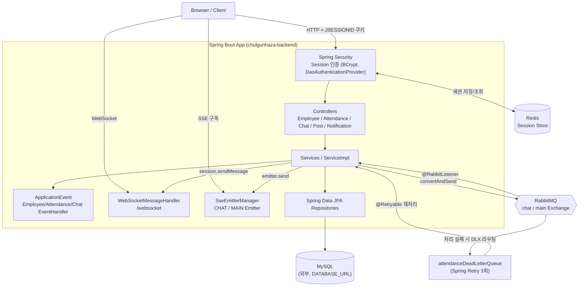

## 출근하자! 
출퇴근 기록과 실시간 소통 기능을 강화해 효율적이고 원활한 업무 환경을 제공합니다. 직원들이 편리하게 소통하고 근무를 관리할 수 있는 간단한 그룹웨어 시스템입니다. 

## 기간
2025.01 ~ 진행 중

## 프로젝트 목표
- 직원 관리
- 실시간 소통 및 알림 시스템
- 연차 및 근무 시간 관리
- 근태 현황 시각화
- 관리자와 근태 담당자의 업무 효율화
- 동시성 제어
- 데이터베이스 샤딩
- 부하 테스트

## 주요 기능
- 실시간 채팅 - WebSocket, Redis, Message Queue 사용 
- 페이징 처리 
- 권한 관리 - Admin, 근태 담장자, 사원 분리 
- 파일 업로드 - MultiPartFile 사용 추후 S3 마이그레이션 
- 동시성 제어 - 연차 사용 동시성 제어
- 트래픽 처리- Message Queue를 활용한 트래픽 처리
- 정산 처리 - Spring Batch를 활용한 출근 정산 
- 로그인 - 세션 로그인  
- 소프트 딜리트 - delFlag 를 필드를 통해 소프트 딜리트
- 레플리카 - Redis 및 DB 다운 시 복구 서버 구축
- 로그 관리 - AOP 를 활용해 로그 추적 및 스케쥴러로 파일 관리

## 기술

## 아키텍처

### 계층 구조
- **Controller** → **Service(Impl)** → **Repository(JPA)** → **MySQL** 로 이어지는 전형적인 계층형 구조이며, 도메인은 `member`, `attendance`, `annual`, `leaveWork`, `board`, `chat` 로 분리되어 있습니다.
- 인증/인가는 `SecurityConfig` 에서 세션 기반(`SessionCreationPolicy.NEVER`, 세션 자체는 필요 시에만 생성)으로 구성되고, 세션 저장소는 `spring-session-data-redis` 로 Redis에 위임합니다(`RedisConfig`, `SessionConfig`). 이를 통해 WAS(애플리케이션 서버)가 여러 대여도 세션을 공유할 수 있고, README에 언급된 "레플리카" 목표(Redis/DB 다운 시 복구)의 기반이 됩니다.
- 도메인 간 부수 효과(알림 발송 등)는 RabbitMQ를 직접 호출하는 대신 **Spring `ApplicationEvent`** (`event/attendance`, `event/chat`, `event/employee`)로 한 번 더 분리되어 있어, 이벤트 발행부와 처리부가 느슨하게 결합되어 있습니다.

### 메시징(RabbitMQ) 토폴로지
- `chulgunhazabackend_main` Exchange(Direct) → `attendance_queue`(출근 등록), `leave_work_queue`(연차), `main_notification_queue`(근태 알림)
- `chulgunhazabackend_chat` Exchange(Direct) → `chat_queue`(채팅 저장), `chat_notification_queue`(채팅 알림)
- `attendance_queue` 는 `x-dead-letter-exchange` 로 `deadLetterExchange` 를 지정해두어, 컨슈머가 `basicNack` 하면 메시지가 `attendanceDeadLetterQueue` 로 이동하고, `AttendanceDeadLetterListener` 가 `@Retryable`(최대 3회, 1초 간격)로 재처리를 시도한 뒤 실패하면 `@Recover` 로 넘어갑니다.
- 채팅은 WebSocket으로 받은 메시지를 바로 DB에 쓰지 않고 RabbitMQ에 적재한 뒤 `ChatMessageListener` 가 비동기로 저장하도록 해서, 순간적으로 채팅이 몰려도 DB 부하를 큐가 완충합니다.

### 실시간 통신 (WebSocket + SSE 조합)
- **WebSocket**(`/websocket`, `WebSocketMessageHandler`): 채팅방 `subscribe`/`unsubscribe` 세션을 `ConcurrentHashMap<userId, ConcurrentHashMap<chatRoomId, WebSocketSession>>` 형태로 들고 있다가 새 메시지가 오면 바로 push 합니다. STOMP 없이 순수 `WebSocketHandler` + 커스텀 프로토콜로 라우팅하고, `SecurityContextInterceptor` 로 핸드셰이크 시점에 인증 정보를 함께 실어 보냅니다.
- **SSE**(`/v1/notifications/subscribe/chat`, `SseEmitterManager`): 채팅방에 접속해 있지 않은 사용자에게 "새 메시지 알림"만 보내는 채널입니다. `EmitterType.CHAT`/`EmitterType.MAIN` 두 종류로 나눠 관리하며, 지금은 CHAT만 열려 있고 MAIN(근태)은 미구현입니다.
- 즉 "메시지 본문 전달"은 WebSocket, "안 보고 있는 사람에게 알림만 찌르기"는 SSE로 역할이 나뉘어 있습니다.

## 인프라 / docker-compose

`compose.yaml` 은 로컬 개발 편의를 위한 보조 인프라만 담당하고, MySQL은 포함되어 있지 않습니다(환경변수 `DATABASE_URL` 로 외부 MySQL을 직접 가리킵니다). `spring-boot-docker-compose`(devtools) 의존성 덕분에 로컬에서 앱을 뜨우면 스프링이 이 compose 파일을 자동으로 `up` 시켜줍니다.

| 서비스 | 이미지 | 포트 | 역할 |
|---|---|---|---|
| rabbitmq | rabbitmq:management | 5672(AMQP), 15672(관리 UI) | 채팅/근태 메시지 큐 |
| redis | redis:latest | 6379 | 세션 스토어 |
| MySQL | (compose 밖, 외부) | 3306 | 메인 데이터베이스 |

### 로컬 실행 방법
1. `.env` 에 `RMQ_USER`, `RMQ_PASS`, `REDIS_PASS`, `DATABASE_URL`, `DATABASE_USER`, `DATABASE_PASSWORD`, `SPRING_REDIS_HOST`, `SPRING_REDIS_PASS`, `UPLOAD_DIR` 값을 채워둡니다.
2. MySQL을 직접 띄우거나 접속 가능한 상태로 준비합니다 — compose.yaml에는 포함되어 있지 않습니다.
3. `./gradlew bootRun` 으로 실행하면 `spring-boot-docker-compose` 가 redis/rabbitmq를 자동으로 띄워줍니다. 수동으로 띄우려면 `docker compose up -d` 를 먼저 실행해도 됩니다.
4. 서버가 처음 뜨면 로그인용 테스트 계정과 채팅 더미 데이터를 자동으로 만들어둡니다(`DataInitializer`, 이미 있으면 건너뜀) — 회원가입 API가 따로 없어서, 이거 없이는 갓 받은 DB로 로그인도, 화면 확인도 할 방법이 없습니다.
   - 로그인: 이메일 `test@chulgunhaza.com` / 비밀번호 `test1234!`
   - 채팅: 위 계정 기준으로 동료 10명과의 1:1 채팅방 10개, 방마다 메시지 250개(최근 며칠 치처럼 보이게 15분 간격으로 배치)를 같이 만들어서 방 목록/무한 스크롤 페이징을 바로 확인할 수 있게 했습니다.
   - 운영 배포 시에는 `app.seed-demo-account=false` 로 꺼둡니다.

## 확장 제안: 모니터링 & Docker/Kubernetes 배포

아래 두 가지는 저장소에 아직 반영되지 않은 **제안 사항**입니다.

### 모니터링 (현재 미구현)
`build.gradle` 에 actuator/micrometer/prometheus 관련 의존성이 전혀 없어서, RabbitMQ 관리 UI(`:15672`)가 사실상 유일한 모니터링 창구입니다. `spring-boot-starter-actuator` + Micrometer(Prometheus registry) + Prometheus + Grafana 를 추가하면 API 응답시간, RabbitMQ 큐 적재량, DB 커넥션풀 등을 시각화할 수 있습니다. 아래 "AOP 로그 추적" 이슈와 로그 수집(Loki/ELK)을 함께 엮으면 관측 스택이 완결됩니다.

### Docker & Kubernetes 배포 (현재 미구현)
저장소에 `Dockerfile`/K8s manifest가 전혀 없고, `compose.yaml`은 로컬 개발용 redis/rabbitmq만 담당합니다. 제안하는 흐름은 다음과 같습니다.

- 멀티스테이지 `Dockerfile`(gradle build → JRE 런타임 이미지) → Container Registry(ECR/DockerHub)
- K8s `Deployment`(App Pod) + `Service` + `Ingress`, 환경변수는 `ConfigMap`/`Secret` 으로 주입
- 트래픽 대응을 위한 `HPA`(Horizontal Pod Autoscaler)
- 운영 환경에서는 MySQL/Redis/RabbitMQ를 컨테이너 대신 RDS / ElastiCache / Amazon MQ 같은 관리형 서비스로 옮기는 것을 권장 (특히 **파일 업로드 S3 마이그레이션이 K8s 멀티 Pod 배포보다 반드시 선행**되어야 합니다 — 로컬 디스크 저장인 채로 여러 Pod를 띄우면 Pod마다 파일이 따로 저장되어 조회가 깨집니다)

## 리팩토링 우선순위 로드맵

코드 전체의 TODO/HACK 코멘트와 README 목표 대비 실제 구현 갭을 분석해서 5단계로 우선순위를 정했습니다. 뒤 단계로 갈수록 앞 단계가 끝나 있어야 효과가 제대로 나옵니다.

### Phase 0 — 즉시 처리 (보안/버그, 반나절~1일)
- **CORS 와일드카드 + credentials 조합 수정** — 가장 먼저. 지금 배포되면 바로 보안 이슈로 이어질 수 있음.
- **HTTPS 설정** — 위와 같이 묶어서 처리.
- **Post–User 연동 주석 정리, 사원 프로필 이미지 업로드 완성** — 반쯤 끝난 기능 마무리.
- **AsyncConfig, SseEmitter 타임아웃, RabbitMQ 리스너 정리** — 코드에 남은 HACK 주석 3개, 작고 독립적.

### Phase 1 — 관측 가능성 확보 (약 1주)
- **모니터링**(Actuator + Micrometer + Prometheus + Grafana, 위 "확장 제안" 참고)
- **AOP 로그 추적 + 로그 스케줄러**
- **Swagger/OpenAPI 문서화**

### Phase 2 — 미구현 핵심 기능 완성 (약 1~2주)
- **연차 사용 동시성 제어** — 데이터 정합성 문제라 다른 기능보다 먼저. 이게 안 된 상태로 부하 테스트를 하면 동시성 버그만 계속 잡게 됨.
- **근태(MAIN) SSE 알림 구현** — `SseEmitterManager` 골격이 이미 있어 상대적으로 빠르게 끝낼 수 있음.

### Phase 3 — 배포 인프라 (약 1주)
- **파일 업로드 S3 마이그레이션** — 반드시 K8s 배포보다 먼저.
- **Docker & Kubernetes 배포** (위 "확장 제안" 참고) — S3 마이그레이션 이후에 진행.

### Phase 4 — 검증 및 스케일 판단 (1주 이상)
- **부하 테스트** — 반드시 Phase 2(동시성 수정)와 Phase 3(배포 + 모니터링) 이후에.
- **DB 샤딩** — 부하 테스트 결과를 보고 실제로 필요한지 먼저 판단. 리스크가 가장 큰 변경이라 데이터로 검증 후 착수 권장.
- **Spring Batch 출근 정산** — 인프라가 안정된 뒤에 붙이는 걸 권장.

### Phase 5 — 마무리
- **README 기술 스택 동기화** — 모든 변경이 끝난 뒤 마지막에 한 번에 정리.

## 이슈 후보 목록

`.github/ISSUE_TEMPLATE/` 에 Feature/Bug/Refactor/Chore 템플릿을 추가해두었으니, 아래 항목을 그대로 GitHub Issue 제목+본문으로 옮겨서 등록하시면 됩니다.

### 🟥 미구현 기능 (README 목표 vs 실제 코드 갭)

1. **[기능] 근태(MAIN) SSE 알림 구현** (`enhancement`, `notification`) — `NotificationController` 에 `MAIN Controller 생성` TODO만 남아있음. `controller/NotificationController.java:30`
2. **[기능] Spring Batch 기반 출근 정산 구현** (`enhancement`, `batch`) — README에 명시되어 있으나 관련 의존성/Job/Step 코드 없음.
3. **[기능] 연차 사용 동시성 제어** (`enhancement`, `concurrency`) — `@Lock`, `synchronized`, 분산락 관련 코드 없음.
4. **[기능] 데이터베이스 샤딩 검토/적용** (`enhancement`, `database`) — 현재 단일 `DATABASE_URL` 만 사용.
5. **[기능] 부하 테스트 수행 및 결과 문서화** (`testing`) — 테스트 코드가 `EmployeeRepositoryTest`, `ChugunhazaBackendApplicationTests` 2개뿐.
6. **[기능] AOP 기반 로그 추적 + 로그 파일 스케줄러** (`enhancement`, `observability`) — `@Aspect`/`@Around` 등 AOP 클래스 없음.
7. **[기능] Swagger/OpenAPI 문서화 연동** (`documentation`) — `springdoc-openapi` 등 관련 의존성 없음.
8. **[기능] 파일 업로드 S3 마이그레이션** (`enhancement`, `infra`) — 현재 `LocalFileServiceImpl` 로 로컬 디스크만 사용. `FileService` 인터페이스는 이미 분리되어 있음.

### 🟧 코드에 남아있는 TODO / HACK 정리

9. **[버그/보안] CORS 와일드카드 + credentials 조합 재검토** (`security`, `bug`) — `config/SecurityConfig.java:127`
10. **[리팩토링] AsyncConfig 임시 설정 재검토** (`refactor`) — `config/AsyncConfig.java:14`
11. **[리팩토링] SseEmitter 타임아웃 값 조정** (`refactor`) — `service/sse/SseEmitterManager.java:30`
12. **[리팩토링] RabbitMQ 리스너/서비스 로직 정리** (`refactor`) — `service/impl/ChatRabbitMQMessageServiceImpl.java:64`, `service/impl/ChatMessageServiceImpl.java:65`, `controller/ChatController.java:44,51`
13. **[기능] 사원 프로필 이미지 업로드 서비스 완성** (`enhancement`) — `service/impl/EmployeeServiceImpl.java:78,122`
14. **[리팩토링] Post - User 연동 주석 정리** (`refactor`) — `domain/board/Post.java:26`, `service/impl/PostServiceImpl.java:32`

### 🟨 문서/설정

15. **[설정] HTTPS 적용** (`infra`, `security`) — `application.yml` 에 "https 설정 추가 예정" 주석만 존재.
16. **[문서] README 기술 스택과 실제 구현 동기화** (`documentation`) — Nginx/Swagger 배지가 있으나 관련 설정/의존성 미확인.

## 팀원 
|임솔|김태동|
|-------------------|---------------------------|
| | |
| 백엔드 개발 | 백엔드 개발 |
| [깃허브 링크](https://github.com/saulsol)    | [깃허브 링크](https://github.com/rlaxoehd4234) |
