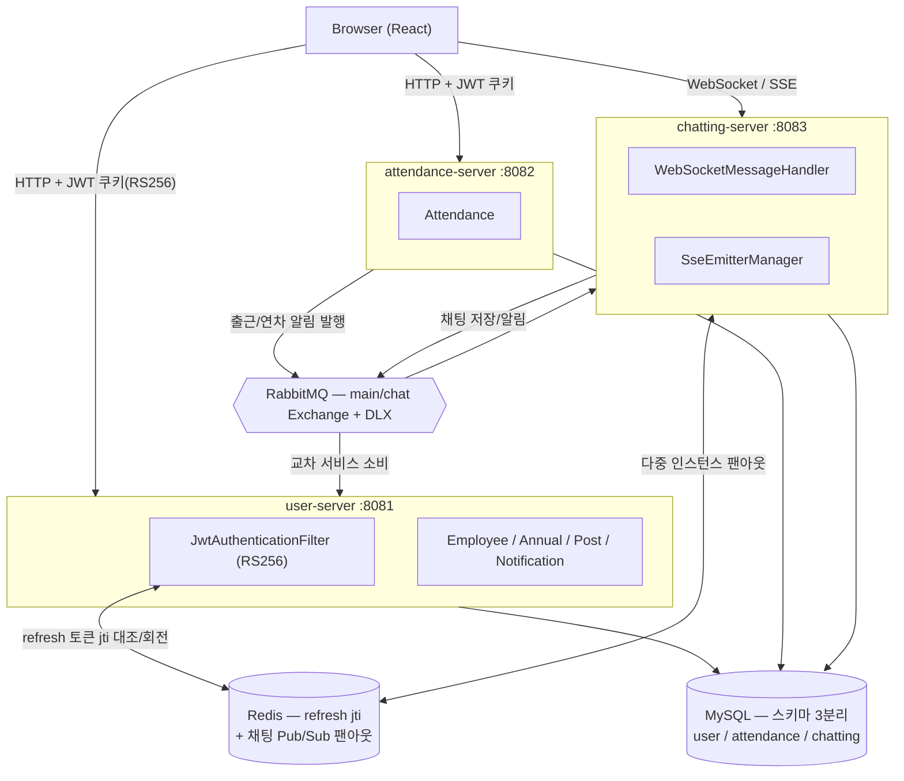

## 출근하자!

직원 출퇴근 기록과 실시간 소통을 지원하는 사내 그룹웨어 백엔드입니다. 세션 기반 모놀리식으로
시작해 **JWT 인증 전환 → 서비스 3개 물리 분리 → Kubernetes(kubeadm) 배포**까지 직접
설계하고 실측 검증했습니다.

- **기간**: 2025.01 ~ 진행 중 · **팀**: 백엔드 2인
- **프론트엔드**: [chulgunhaza-frontend](https://github.com/chulgunhaza/chulgunhaza-frontend)
- **로컬 실행 방법**: [docs/local-development.md](docs/local-development.md)

## 기술 스택

-6DB33F)

## 아키텍처

```mermaid
graph TB
    Browser["Browser (React)"]

    subgraph US["user-server :8081"]
        UJwt["JwtAuthenticationFilter (RS256)"]
        UCtrl["Employee / Annual / Post / Notification"]
    end
    subgraph AS["attendance-server :8082"]
        ACtrl["Attendance"]
    end
    subgraph CS["chatting-server :8083"]
        CWs["WebSocketMessageHandler"]
        CSse["SseEmitterManager"]
    end

    MySQL[("MySQL — 스키마 3분리<br/>user / attendance / chatting")]
    Redis[("Redis — refresh jti<br/>+ 채팅 Pub/Sub 팬아웃")]
    RabbitMQ{{"RabbitMQ — main/chat Exchange + DLX"}}

    Browser -->|"HTTP + JWT 쿠키(RS256)"| US
    Browser -->|"HTTP + JWT 쿠키"| AS
    Browser -->|"WebSocket / SSE"| CS

    US --> MySQL
    AS --> MySQL
    CS --> MySQL
    UJwt <-->|"refresh 토큰 jti 대조/회전"| Redis
    CS <-->|"다중 인스턴스 팬아웃"| Redis

    AS -->|"출근/연차 알림 발행"| RabbitMQ -->|"교차 서비스 소비"| US
    CS -->|"채팅 저장/알림"| RabbitMQ --> CS
```

### 설계 포인트
- **인증**: `SessionCreationPolicy.NEVER`로 세션 자체를 안 씀. `JwtAuthenticationFilter`가 매 요청마다 `access_token` 쿠키 서명만 검증해서 서비스를 여러 대로 늘려도 세션 공유가 필요 없음 — [docs/jwt-authentication.md](docs/jwt-authentication.md)
- **애그리거트 경계**: `Attendance`/`Chat`/`AnnualRecord`는 `Employee`를 `@ManyToOne` 대신 `Long employeeId`로만 참조 — 물리적으로 다른 애그리거트를 객체 그래프로 묶으면 스키마 분리 시 코드가 깨진다는 걸 실제 인시던트로 겪은 뒤 정리한 원칙. `Post`는 아직 이 규칙을 못 지킨 예외([#104](https://github.com/chulgunhaza/chulgunhaza-backend/issues/104)) — 판단 기준 전체는 [docs/aggregate-boundaries.md](docs/aggregate-boundaries.md)
- **연차 사용 동시성 제어**: `SELECT ... FOR UPDATE` 비관적 락으로 사원 행을 잠가 동시 요청 시 잔여 연차 초과 사용(lost update)을 방지, `CountDownLatch` 기반 동시성 테스트로 검증
- **RabbitMQ 토폴로지**: `main` Exchange(Direct) → 출근/연차 알림(attendance-server 발행 → user-server 소비, 교차 서비스), `chat` Exchange(Direct) → 채팅 저장/알림. 처리 실패 메시지는 DLX로 격리 후 `@Retryable`(최대 3회)로 재처리
- **실시간 통신**: "메시지 본문 전달"은 WebSocket(순수 핸들러 + 커스텀 프로토콜, STOMP 미사용), "안 보고 있는 사람에게 알림만"은 SSE로 역할 분리. chatting-server를 여러 인스턴스로 확장해도 Redis Pub/Sub 팬아웃으로 어느 인스턴스에 붙은 소켓이든 메시지를 받게 구현 — [docs/attendance-server-migration.md](docs/attendance-server-migration.md)

## 주요 기능
- 실시간 1:1/그룹 채팅, 참여자별 독립 읽음 추적(`lastReadMessageId`)
- 근태(출근/연차) 처리 결과 SSE 실시간 알림
- 연차 사용 동시성 제어, 페이징, Admin/근태 담당자/사원 권한 분리
- 사원 프로필·게시글 이미지 업로드
- JWT(RS256, httpOnly 쿠키) access/refresh 인증 — 세션(Redis) 방식에서 전환([#98](https://github.com/chulgunhaza/chulgunhaza-backend/issues/98))
- CORS 화이트리스트, 소프트 딜리트(`delFlag`)
- Swagger/OpenAPI 문서화(user-server), GitHub Actions CI(PR/push 시 테스트 자동 실행)

## 테스트
단위 + 실제 DB 통합 테스트 12개 클래스. 특히:
- **동시성 테스트**: 여러 스레드를 `CountDownLatch`로 정확히 같은 순간에 출발시켜 연차 초과 사용이 발생하지 않는지 검증
- **쿼리 카운트 회귀 테스트**: Hibernate Statistics로 채팅방 목록 조회가 N+1 없이 상수 쿼리 수로 끝나는지 실측 검증

## 배포
Podman으로 서비스별 이미지를 빌드해 레지스트리 없이 containerd에 직접 import하고, kubeadm 단일 노드 클러스터에 배포하는 스크립트(`scripts/vm-deploy.sh`)까지 만들어 실제 VM에서 로그인·출근 등록·채팅까지 검증 완료했습니다. 설계 근거·트러블슈팅은 [docs/kubeadm-vm-deployment.md](docs/kubeadm-vm-deployment.md) 참고.

## 진행 상황

```mermaid
flowchart LR
    classDef done fill:#d4edda,stroke:#28a745,color:#155724
    classDef progress fill:#fff3cd,stroke:#ffc107,color:#856404
    classDef todo fill:#f1f1f1,stroke:#adb5bd,color:#495057

    A["#98 JWT(RS256) 전환"]:::done --> B["#99 멀티모듈 + 스키마 분리"]:::done
    B --> C["#100 attendance-server 분리"]:::done
    C --> D["#101 chatting-server 분리<br/>+ Redis Pub/Sub 팬아웃"]:::done
    D --> E["kubeadm VM 배포"]:::done
    E --> F["CD 파이프라인<br/>(GitHub Actions 셀프호스티드 러너)"]:::progress
    F --> G["#102 user-server 정리"]:::todo
    G --> H["#104 Post.employee<br/>ID 참조 전환"]:::todo
```

**남은 작업**: CD 파이프라인 자동화(진행 중), Post 애그리거트 경계 정리([#104](https://github.com/chulgunhaza/chulgunhaza-backend/issues/104)), user-server 이벤트 실구현([#102](https://github.com/chulgunhaza/chulgunhaza-backend/issues/102)), 부하 테스트·DB 샤딩 검토, Spring Batch 기반 정산 자동화, 파일 업로드 S3 마이그레이션, HTTPS 적용 — 전체 이슈는 [GitHub Issues](https://github.com/chulgunhaza/chulgunhaza-backend/issues) 참고.

## 팀원
|임솔|김태동|
|-------------------|---------------------------|
| | |
| 백엔드 개발 | 백엔드 개발 |
| [깃허브 링크](https://github.com/saulsol) | [깃허브 링크](https://github.com/rlaxoehd4234) |
