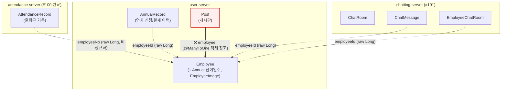

# 애그리거트 경계 기준과 서비스 분리 매핑

[#74](https://github.com/chulgunhaza/chulgunhaza-backend/issues/74)(서비스 분리
로드맵)와 [#98](https://github.com/chulgunhaza/chulgunhaza-backend/issues/98)(JWT
전환) 작업 중 "JWT 클레임에 뭘 담을지"를 정하려면 Employee 애그리거트의 "공개
표면"이 뭔지부터 명확해야 했다. 그 김에 지금까지 암묵적으로만 지켜오던 애그리거트
경계 판단 기준을 명시적으로 정리하고, 실제 코드에 적용한 결과를 기록해둔다.

## 판단 기준 (3가지 테스트)

1. **트랜잭션 경계**: 이 두 엔티티가 항상 같은 트랜잭션에서 함께 바뀌어야 하는가?
   아니라면 별개 애그리거트.
2. **독자적 생명주기**: 부모 없이 자기 혼자 조회/목록/페이지네이션 API를 갖는가?
   그렇다면 별개 애그리거트의 루트.
3. **참조 방향**: 다른 애그리거트를 가리킬 땐 무조건 raw `Long id`만. JPA
   `@ManyToOne` 객체 참조 금지 — 그 순간 두 애그리거트가 쿼리/트랜잭션에 물리적으로
   묶여서, DB(스키마)를 쪼개는 순간 깨진다.

세 번째 기준이 가장 중요하다. `@ManyToOne`으로 다른 애그리거트를 물면 lazy-loading이
의도치 않게 다른 애그리거트의 객체 그래프를 끌고 들어오고, 그 순간부터는 두 애그리거트가
정말로 하나의 트랜잭션/쿼리에 묶여버려서 스키마를 나누는 순간 코드가 깨진다.

## 현재 코드에 적용한 결과

| 엔티티 | 애그리거트 | 목표 서비스 | 참조 방식 | 상태 |
|---|---|---|---|---|
| `Employee` (+ `Annual`, `EmployeeImage`) | Employee | user-server | 루트 | — |
| `AttendanceRecord` | Attendance | attendance-server ([#100](https://github.com/chulgunhaza/chulgunhaza-backend/issues/100) 완료) | `Long employeeNo` + `employeeName`(비정규화) | ✅ |
| `AnnualRecord` | AnnualRecord | user-server 잔류 | `Long employeeId` | ✅ |
| `ChatRoom` / `ChatMessage` / `EmployeeChatRoom` | Chat | chatting-server ([#101](https://github.com/chulgunhaza/chulgunhaza-backend/issues/101)) | `Long employeeId` | ✅ ([#77](https://github.com/chulgunhaza/chulgunhaza-backend/pull/77)에서 정리) |
| `Post` | Post | user-server 잔류 | `@ManyToOne Employee` | ❌ **위반** |

> **정정**: 이 표는 원래 `AttendanceRecord`도 이미 `employeeId` 참조라 문제없다고
> 적어뒀었는데, 실제로는 `Post`와 똑같이 `@ManyToOne Employee` 객체 참조였다 —
> [#100](https://github.com/chulgunhaza/chulgunhaza-backend/issues/100) 작업 중
> 실제로 뜯어보다가 발견하고 바로잡았다. 이 문서만 보고 판단하지 말고 항상
> 코드를 직접 확인할 것.

## 남은 위반: `Post.employee`

`Post`는 아직 `@ManyToOne Employee` 객체 참조를 쓰고 있다
(`domain/board/Post.java`). `Post`가 user-server에 그대로 남을 예정이라 지금 당장
스키마 분리를 막는 건 아니지만, 나머지 전부가 지킨 규칙을 혼자 어기고 있어서
일관성이 깨져 있다. `Chat`(#77)과 `Attendance`(#100)가 받은 것과 동일한 처리
(`Long employeeId`/`employeeNo`로 전환 + 이름 등 표시용 필드는 서비스 레이어
조합 또는 비정규화)를 해주는 게 일관성 있고, 언젠가 게시판을 별도 서비스로
뺄 가능성에도 대비된다. 이미 [#104](https://github.com/chulgunhaza/chulgunhaza-backend/issues/104)로
이슈화해뒀다.

## 서비스 분리 시 "다른 애그리거트 이름 조회" 문제를 푸는 방법

DB가 물리적으로 나뉘면 `employeeId`만으로는 이름/부서 같은 표시용 정보를 JOIN해서
가져올 수 없다. 두 가지 방식을 검토했다(#100/#101 이슈에 기록):

| 방식 | 적용 대상 | 이유 |
|---|---|---|
| **쓰기 시점에 이름 비정규화** (기록 생성 시 JWT 클레임의 이름을 그대로 저장) | `AttendanceRecord`, `ChatMessage` | 둘 다 "그 시점의 기록"이라 발급 당시 이름이 고정되는 게 오히려 맞는 동작. 서버 간 호출이 전혀 필요 없어 장애 전파도 없음 |
| **user-server 내부 조회 API** (`GET /internal/employees?ids=...`) | 대시보드 통계처럼 "현재" 조직도 기준이어야 하는 화면 | "지금" 값을 정확히 보여줘야 하는 소수의 지점에만 예외적으로 사용 |

`ChatRoom`의 로컬 복제본(`ChatMember`, [#101](https://github.com/chulgunhaza/chulgunhaza-backend/issues/101))처럼
자주 바뀌는 표시 정보를 이벤트로 동기화하는 방식도 있지만, 지금 규모에서는 과설계로
판단해 위 두 가지로 충분한 곳부터 적용한다.

**#100에서 실제로 적용한 결과**: `AttendanceRecord`는 예상대로 첫 번째 방식
(쓰기 시점 비정규화, `employeeNo`/`employeeName`)으로 갔다. 두 번째 방식은
원래 예상했던 "다른 애그리거트 이름 조회"가 아니라 **집계값 조회**(대시보드의
오늘 출근 수)에도 그대로 적용됐다 — user-server가 attendance-server의
`GET /internal/attendance/today-count`를 동기 호출하는 형태로, 이름 대신 숫자를
가져온다는 점만 다르고 "가끔 필요한 소수 지점만 내부 API로" 원칙은 동일하다.
자세한 내용은 [docs/attendance-server-migration.md](attendance-server-migration.md).
